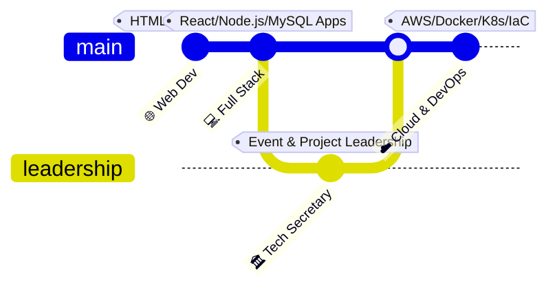

<!-- ═══════════════════════════════════════════════════════════════ -->
<!--                        HEADER BANNER                          -->
<!-- ═══════════════════════════════════════════════════════════════ -->

---

<!-- ═══════════════════════════════════════════════════════════════ -->
<!--                      AT A GLANCE                              -->
<!-- ═══════════════════════════════════════════════════════════════ -->

### `☁️ Beyond the code`

<table width="100%">
<tr>
<td>
<pre>
<i>// Systems & Leadership Console Terminal</i>
<b>rishabh-kankariya</b> <b>$</b> cat profile.json
{
  "name": "Rishabh Kankariya",
  "location": "Ujjain, Madhya Pradesh, India 📍",
  "education": "B.Tech CSE @ MIT-ADT University 🎓",
  "leadership": "Technical Secretary @ Zone Of Engineering Innovators 🏛️",
  "career_focus": "Cloud & DevOps Engineering ☁️ 🚀",
  "status": "Automating infra · Orchestrating containers · Fostering tech communities"
}
</pre>
</td>
</tr>
</table>

 

---

<!-- ═══════════════════════════════════════════════════════════════ -->
<!--                       WHO I AM                                -->
<!-- ═══════════════════════════════════════════════════════════════ -->

<table width="100%">
  <tr>
    <td width="60%" valign="top">
      <h2>👤 Who I Am</h2>
      
I am a Computer Science Engineering student specializing in cloud infrastructure, virtualization, and automated deployment architectures. By blending strong software development foundations with hands-on systems operations, I build applications designed to scale.

      
As the <b>Technical Secretary at Zone Of Engineering Innovators (ZEI)</b>, I bridge the gap between technical design and team execution, leading community hackathons and guiding student developers from local code execution to automated cloud deployment.

    </td>
    <td width="40%" valign="top">
      <h2>⚡ Operating Principles</h2>
      <ul>
        <li><b>Automate Everything:</b> If a workflow is repeated twice, it deserves a script/pipeline.</li>
        <li><b>IaC Over ClickOps:</b> Maintain reproducible setups through declarative config files.</li>
        <li><b>Security by Design:</b> Restrict access controls and secure namespaces early on.</li>
        <li><b>Community First:</b> Accelerate technical ecosystems through knowledge sharing.</li>
      </ul>
    </td>
  </tr>
</table>

---

<!-- ═══════════════════════════════════════════════════════════════ -->
<!--                    CURRENT FOCUS                              -->
<!-- ═══════════════════════════════════════════════════════════════ -->

## 🚀 Current Focus & Milestones

- 🛠️ **Infrastructure as Code**: Writing modular, reusable configurations with **Terraform** for declarative environment setup.
- 🐳 **Containerization & Orchestration**: Scaling services through **Docker** containerization and managing cluster lifecycles using **Kubernetes**.
- ⚡ **CI/CD Pipelines**: Automating testing, building, and deployment processes using **GitHub Actions**.
- ☁️ **Cloud Native Architectures**: Hosting and monitoring high-availability architectures on **AWS**.

---

<!-- ═══════════════════════════════════════════════════════════════ -->
<!--                 LEARNING TIMELINE                             -->
<!-- ═══════════════════════════════════════════════════════════════ -->

## 🗺️ Learning & Growth Journey

*   **🌐 Web Development Era (The Foundation)**
    *   *Focus:* Mastered client-side fundamentals (HTML, CSS, JavaScript) to understand browser mechanics and user interactions.
*   **💻 Full Stack Projects (Connecting Logic & Data)**
    *   *Focus:* Expanded into full-stack architecture using **React** for interactive frontends, **Node.js** for RESTful API logic, and **MySQL** for structured data modeling.
*   **🏛️ Leadership Experience (Community & Collaboration)**
    *   *Focus:* Took on the role of **Technical Secretary** at Zone Of Engineering Innovators. Facilitated peer-to-peer mentoring, designed workshop curriculums, and coordinated large-scale developer gatherings.
*   **☁️ Cloud & DevOps Transition (Scale & Automation)**
    *   *Focus:* Currently specializing in cloud-native paradigms, container virtualization, systems administration on **Linux**, and infrastructure automation using **Terraform** and **GitHub Actions**.

---

<!-- ═══════════════════════════════════════════════════════════════ -->
<!--                    TECH STACK & SKILLS                        -->
<!-- ═══════════════════════════════════════════════════════════════ -->

## ⚙️ Core Technical Arsenal

**Cloud & Orchestration**

**Infrastructure as Code & OS**

**CI/CD & Version Control**

**Full-Stack & Databases**

---

<!-- ═══════════════════════════════════════════════════════════════ -->
<!--                 FEATURED PROJECTS                             -->
<!-- ═══════════════════════════════════════════════════════════════ -->

## 🛠️ Featured Projects

<table width="100%">
  <tr>
    <td width="50%" valign="top">
      <h3>🇮🇳 <a href="https://github.com/rishabhkankariya/AI-for-Bharat_Single-Window-System-Project-Team-gitignore">AI For Bharat Project</a></h3>
      
A collaborative project focused on building localized, scalable, AI-driven applications. Standardized system endpoints and automated processing workflows for regional language processing tasks.

      

        
        
        
      

    </td>
    <td width="50%" valign="top">
      <h3>⚡ <a href="https://github.com/rishabhkankariya/ZEN_Project">ZEN Project</a></h3>
      
A specialized project development ecosystem built for <i>Zone of Engineering Innovators</i>. Enables engineering students to host open-source initiatives, share configurations, and collaborate on design structures.

      

        
        
        
      

    </td>
  </tr>
  <tr>
    <td width="50%" valign="top">
      <h3>🚌 <a href="https://github.com/rishabhkankariya/bus-pass-system">Bus Pass System</a></h3>
      
An automated web-based ticketing and pass issuance portal. Restructured transit request handling, automated database record auditing, and optimized validation routes to minimize operational delay.

      

        
        
        
      

    </td>
    <td width="50%" valign="top">
      <h3>🔍 <a href="https://github.com/adityarajlonkar09-commits/CDE">Company Discovery Engine</a></h3>
      
A metadata extraction and search service designed to crawl and query corporate records. Features an optimized indexing layer and clean REST APIs for industrial integration.

      

        
        
        
      

    </td>
  </tr>
</table>

---

<!-- ═══════════════════════════════════════════════════════════════ -->
<!--                LEADERSHIP CALLOUT BOX                         -->
<!-- ═══════════════════════════════════════════════════════════════ -->

## 🏛️ Leadership & Community

> ### 🎙️ Technical Secretary — Zone Of Engineering Innovators
>
> *Leading engineering community outreach, orchestrating student hackathons, and designing skill development tracks.*
>
> `Technical Mentoring` &nbsp;·&nbsp; `Systems Design Demos` &nbsp;·&nbsp; `Agile Leadership` &nbsp;·&nbsp; `Community Management`
>
> *"Empowering student engineers to transform conceptual theories into functional systems."*

---

<!-- ═══════════════════════════════════════════════════════════════ -->
<!--                  GITHUB STATS                                 -->
<!-- ═══════════════════════════════════════════════════════════════ -->

## 📊 GitHub Analytics & Metrics

<table width="100%">
  <tr>
    <td align="center" width="50%">
      
    </td>
    <td align="center" width="50%">
      
    </td>
  </tr>
  <tr>
    <td align="center" colspan="2">
      
    </td>
  </tr>
  <tr>
    <td align="center" colspan="2">
      
    </td>
  </tr>
</table>

---

<!-- ═══════════════════════════════════════════════════════════════ -->
<!--             CONTRIBUTION ANALYTICS                            -->
<!-- ═══════════════════════════════════════════════════════════════ -->

## 🧩 Contribution Breakdown

<table width="100%">
  <tr>
    <td align="center" colspan="4">
      
    </td>
  </tr>
  <tr>
    <td align="center" width="25%">
      
    </td>
    <td align="center" width="25%">
      
    </td>
    <td align="center" width="25%">
      
    </td>
    <td align="center" width="25%">
      
    </td>
  </tr>
</table>

---

<!-- ═══════════════════════════════════════════════════════════════ -->
<!--                   LET'S CONNECT                               -->
<!-- ═══════════════════════════════════════════════════════════════ -->

## 🤝 Let's Connect

---

