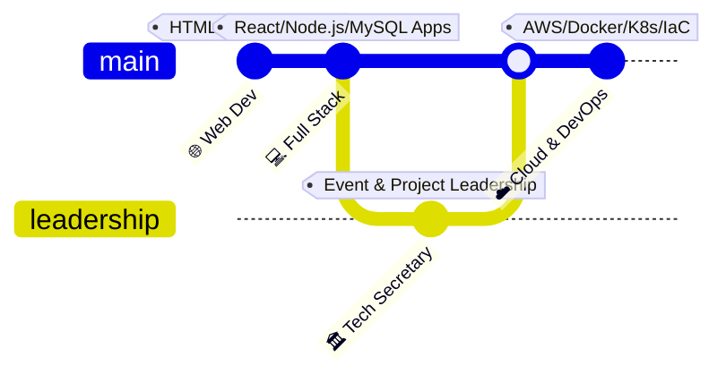

<!-- ═══════════════════════════════════════════════════════════════ -->
<!--                        HEADER BANNER                          -->
<!-- ═══════════════════════════════════════════════════════════════ -->

---

<!-- ═══════════════════════════════════════════════════════════════ -->
<!--                      AT A GLANCE                              -->
<!-- ═══════════════════════════════════════════════════════════════ -->

### `☁️ Beyond the code`

<table width="100%">
<tr>
<td>
<pre>
<i>// Systems & Leadership Console Terminal</i>
<b>rishabh-kankariya</b> <b>$</b> cat profile.json
{
  "name": "Rishabh Kankariya",
  "location": "Ujjain, Madhya Pradesh, India 📍",
  "education": "B.Tech CSE Student @ MIT-ADT University 🎓",
  "leadership": "Technical Secretary @ Zone Of Engineering Innovators 🏛️",
  "career_goal": "Cloud & DevOps Engineering ☁️ 🚀"
}
</pre>
</td>
</tr>
</table>

 

---

<!-- ═══════════════════════════════════════════════════════════════ -->
<!--                       WHO I AM                                -->
<!-- ═══════════════════════════════════════════════════════════════ -->

<table width="100%">
  <tr>
    <td width="60%" valign="top">
      <h2>👤 Who I Am</h2>
      
I am a Computer Science student focused on Cloud Computing, DevOps, and automation. I build full-stack web applications and deploy them using containers and cloud infrastructure.

      
As the <b>Technical Secretary at Zone Of Engineering Innovators (ZEI)</b>, I lead our student tech community, organize hackathons, and help peers learn modern developer workflows.

    </td>
    <td width="40%" valign="top">
      <h2>⚡ What I Practice</h2>
      <ul>
        <li><b>Automate First:</b> Save time by scripting repetitive tasks.</li>
        <li><b>Cloud Native:</b> Build applications using Docker and AWS.</li>
        <li><b>Clean Configs:</b> Keep infrastructure files readable and modular.</li>
        <li><b>Community Sharing:</b> Teach tools to peers to build together.</li>
      </ul>
    </td>
  </tr>
</table>

---

<!-- ═══════════════════════════════════════════════════════════════ -->
<!--                    CURRENT FOCUS                              -->
<!-- ═══════════════════════════════════════════════════════════════ -->

## 🚀 Current Focus & Milestones

- 🛠️ **Infrastructure as Code**: Setting up servers and networks using **Terraform**.
- 🐳 **Containers**: Packaging applications with **Docker** and managing clusters with **Kubernetes**.
- ⚡ **CI/CD Pipelines**: Automating code builds and releases using **GitHub Actions**.
- ☁️ **AWS Cloud**: Running applications on secure, scalable cloud resources.

---

<!-- ═══════════════════════════════════════════════════════════════ -->
<!--                 LEARNING TIMELINE                             -->
<!-- ═══════════════════════════════════════════════════════════════ -->

## 🗺️ Learning & Growth Journey

*   **🌐 Web Development Era (The Foundation)**
    *   *Focus:* Learned HTML, CSS, and JavaScript to build clean, responsive user interfaces.
*   **💻 Full Stack Projects (Connecting Logic & Data)**
    *   *Focus:* Built web apps using **React** for frontends, **Node.js** for backend logic, and **MySQL** for databases.
*   **🏛️ Leadership Experience (Community & Collaboration)**
    *   *Focus:* Appointed **Technical Secretary** at ZEI. Organized student hackathons and mentored peers in coding.
*   **☁️ Cloud & DevOps Transition (Scale & Automation)**
    *   *Focus:* Learning systems administration on **Linux**, **Docker** containers, **Kubernetes**, and cloud hosting on **AWS**.

---

<!-- ═══════════════════════════════════════════════════════════════ -->
<!--                    TECH STACK & SKILLS                        -->
<!-- ═══════════════════════════════════════════════════════════════ -->

## ⚙️ Core Technical Arsenal

**Cloud & Orchestration**

**Infrastructure as Code & OS**

**CI/CD & Version Control**

**Full-Stack & Databases**

---

<!-- ═══════════════════════════════════════════════════════════════ -->
<!--                 FEATURED PROJECTS                             -->
<!-- ═══════════════════════════════════════════════════════════════ -->

## 🛠️ Featured Projects

<table width="100%">
  <tr>
    <td width="50%" valign="top">
      <h3>🚌 <a href="https://github.com/rishabhkankariya/bus-pass-system">Bus Pass System</a></h3>
      
An online student bus pass portal. Replaced manual form registration and paperwork with automated database records and verification routes.

      

        
        
        
      

    </td>
    <td width="50%" valign="top">
      <h3>🇮🇳 <a href="https://github.com/rishabhkankariya/AI-for-Bharat_Single-Window-System-Project-Team-gitignore">AI For Bharat Project</a></h3>
      
A collaborative project focused on scaling AI applications. Created API endpoints, containerized backend services using Docker, and deployed workflows on AWS.

      

        
        
        
      

    </td>
  </tr>
  <tr>
    <td width="50%" valign="top">
      <h3>⚡ <a href="https://github.com/rishabhkankariya/ZEN_Project">ZEN Project</a></h3>
      
A shared resource hub for Zone Of Engineering Innovators (ZEI). Allows members to collaborate on projects, share scripts, and review student source code.

      

        
        
        
      

    </td>
    <td width="50%" valign="top">
      <h3>🔍 <a href="https://github.com/adityarajlonkar09-commits/CDE">Company Discovery Engine</a></h3>
      
A metadata discovery tool. Automatically crawls records from corporate websites, indexes search results in a MySQL database, and runs automated testing (CI/CD).

      

        
        
        
      

    </td>
  </tr>
</table>

---

<!-- ═══════════════════════════════════════════════════════════════ -->
<!--                LEADERSHIP CALLOUT BOX                         -->
<!-- ═══════════════════════════════════════════════════════════════ -->

## 🏛️ Leadership & Community

> ### 🎙️ Technical Secretary — Zone Of Engineering Innovators
>
> *Organizing student hackathons, leading technical workshops, and mentoring peers in web development and systems operations.*
>
> `Technical Mentoring` &nbsp;·&nbsp; `Systems Design Demos` &nbsp;·&nbsp; `Agile Leadership` &nbsp;·&nbsp; `Community Management`
>
> *"Empowering student innovators to learn, collaborate, and build together."*

---

<!-- ═══════════════════════════════════════════════════════════════ -->
<!--                  GITHUB STATS                                 -->
<!-- ═══════════════════════════════════════════════════════════════ -->

## 📊 GitHub Analytics

<table width="100%">
  <tr>
    <td align="center" width="50%">
      
    </td>
    <td align="center" width="50%">
      
    </td>
  </tr>
</table>

---

<!-- ═══════════════════════════════════════════════════════════════ -->
<!--                   LET'S CONNECT                               -->
<!-- ═══════════════════════════════════════════════════════════════ -->

## 🤝 Let's Connect

---

